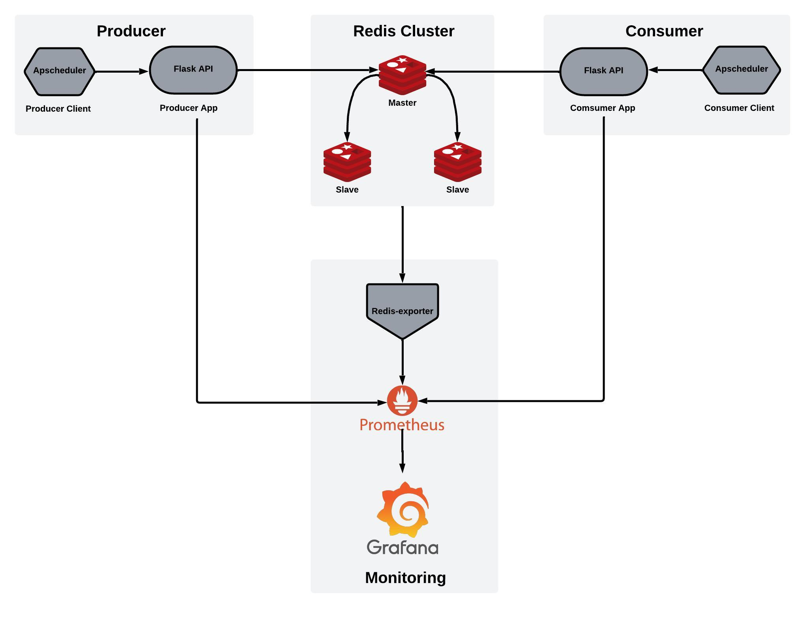

# Garmin Activity Log Monitoring System

## Overview

A comprehensive monitoring system for tracking Garmin user activity logs using modern distributed technologies:
- Real-time user activity log tracking from Garmin watches
- Distributed data storage with Redis Cluster
- Internal log extraction and reporting capabilities

## Architecture

### Core Components

#### Services
- **Producer**: 
  - Generates and processes simulated user activity data
  - Responsible for initial log ingestion

- **Consumer**: 
  - Handles data retrieval for internal reporting
  - Provides interfaces for log extraction

- **Redis Cluster**: 
  - 3-node distributed storage setup
  - Ensures high availability and scalability of log data

### Monitoring Infrastructure

- **Redis-exporter**: Exports detailed Redis performance metrics
- **Prometheus**: Centralized metrics collection and monitoring
- **Grafana**: Interactive metrics visualization and dashboarding

## Deployment

### Prerequisites
- Docker
- Docker Compose

### Quick Start

1. Clone the repository
```bash
git clone <repository-url>
cd garmin-activity-log-monitor

## Project Structure


```txt
project_root/
├── docker/                        # Docker setup for the project
│   ├── Dockerfile.producer-app    # Dockerfile for the producer API
│   ├── Dockerfile.producer-client # Dockerfile for the producer CLI
│   ├── Dockerfile.consumer-app    # Dockerfile for the consumer API
│   └── Dockerfile.consumer-client # Dockerfile for the consumer CLI
│
├── src/                           # Source code directory
│   ├── producer/                  # Producer service: generates and sends user activity data
│   │   ├── __init__.py            # Package initialization
│   │   ├── producer_app.py        # Flask API to produce and push data to Redis
│   │   └── producer_client.py     # CLI or script to simulate producer behavior
│   │
│   └── consumer/                  # Consumer service: processes and aggregates data
│       ├── __init__.py            # Package initialization
│       ├── consumer_app.py        # Flask API to consume and aggregate data from Redis
│       └── consumer_client.py     # CLI or script to simulate consumer behavior
│
├── docker-compose.yml             # Orchestration file for multi-container setup
├── prometheus.yml                 # Configuration file for Prometheus monitoring
├── requirements.txt               # Python dependencies for Dockerfile configuration
├── build_docker_images.sh         # Script to build Docker images
├── project_structure.jpeg         # Diagram of project structure
├── init-cluster.sh                # Script to initialize Redis cluster
├── .gitignore                     # Ignored files for version control
└── README.md                      # Project documentation